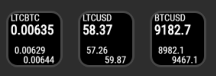

`Crypto ticker` is a plugin to watch crypto rates. Rates are extracted from Bitfinex.

# Description
`Counter` is a simple plugin that displays the number of times a key is pressed. Pressing the key will increase the counter.

# Features
- Code written in pure JavaScript
- Cross-platform (macOS, Windows)
- All Bitfinex pairs are supported (~420 pairs)
- Clicking the button forces the refresh (otherwise refreshes every minute)
- Allows setting a multiplier and number of digits (eg. for very small values, or very big)
- TODO: Real time update

# Installation
In the Release folder, you can find the file `com.courcelle.cryptoticker.streamDeckPlugin`. If you double-click this file on your machine, Stream Deck will install the plugin.

# Source code
The Sources folder contains the source code of the plugin.
