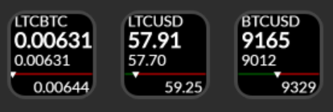
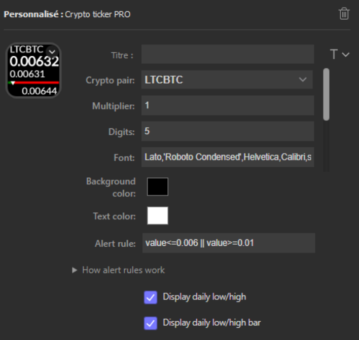
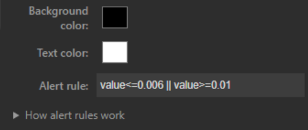

# Crypto ticker PRO StreamDeck plugin
`Crypto ticker PRO` is a plugin to watch crypto rates. Rates are provided by Bitfinex in real time.

## Features
- Code written in pure JavaScript
- Cross-platform (macOS, Windows)
- All Bitfinex pairs are supported (~420 pairs)
- Real time updates (WS connection to Bitfinex)
- A bar shows where the current value sits within daily low/high (ie is it up or down)
- Allows setting a multiplier and number of digits (eg. for very small or big values)
- Can set up custom alerts
- Can customize fonts, colors, which info to display, etc.
- Fully open source!

## Installation
In the Release folder, you can find the file `com.courcelle.cryptoticker.streamDeckPlugin`. If you double-click this file on your machine, Stream Deck will install the plugin.

## Source code
The Sources folder contains the source code of the plugin.
Build the package for distribution by running `DistributionToolWindows/DistributionTool.exe -b -i Sources/com.courcelle.cryptoticker.sdPlugin -o Release` at the root of the project.